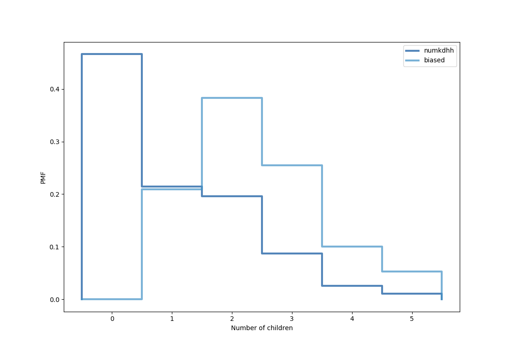

[Think Stats Chapter 3 Exercise 1](http://greenteapress.com/thinkstats2/html/thinkstats2004.html#toc31) (actual vs. biased)


<!---

This problem presents a robust example of actual vs biased data. As a data scientist, it will be important to examine not only the data that is available, but also the data that may be missing but highly relevant. You will see how the absence of this relevant data will bias a dataset, its distribution, and ultimately, its statistical interpretation.


Communicate the problem, how you solved it, and the solution, within each of the following

-->

A problem arises in assessing the average family size by surveying children of said families. Families without children will not be represented at all, and those with many children will be overrepresented. In this analysis, we find that the average number of kids per family from NSFG data is 1.0. When computing a biased value, this increases to 2.4 kids.

1.0 kids

2.4 kids




```
import nsfg, thinkstats2, thinkplot, probability

resp = nsfg.ReadFemResp()
pmf = thinkstats2.Pmf(resp.numkdhh, label='numkdhh')

biased = probability.BiasPmf(pmf, label='biased')
thinkplot.PrePlot(2)
thinkplot.Pmfs([pmf, biased])
thinkplot.Config(xlabel='Number of children', ylabel='PMF')
thinkplot.show()

pmf.Mean()
biased.Mean()


```