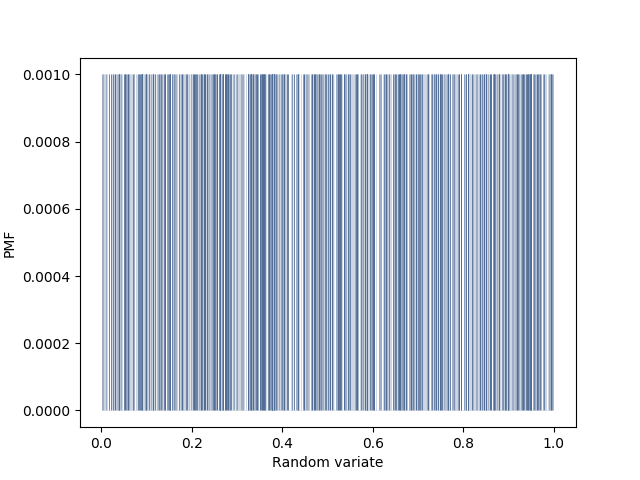
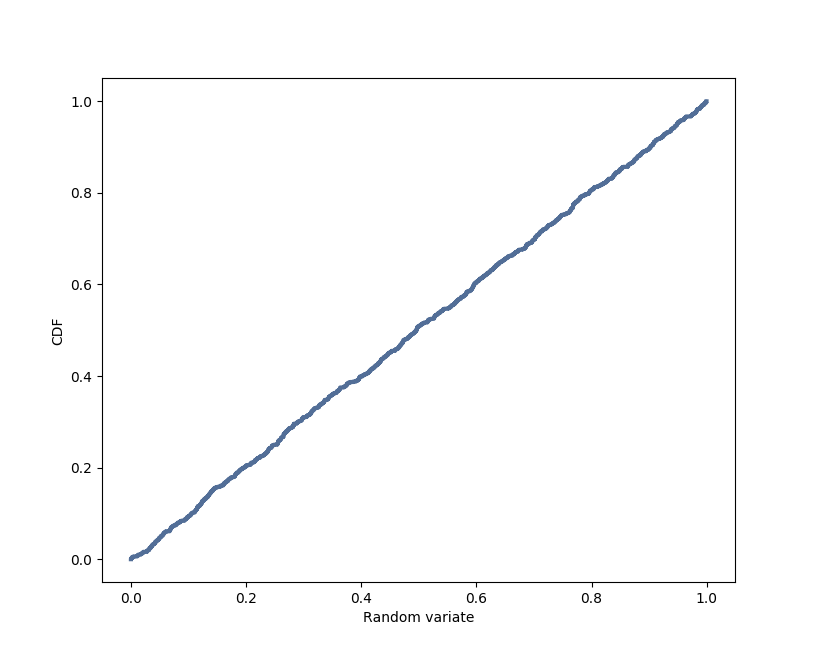

[Think Stats Chapter 4 Exercise 2](http://greenteapress.com/thinkstats2/html/thinkstats2005.html#toc41) (a random distribution)


<!---

Communicate the problem, how you solved it, and the solution, within each of the following

-->

We are to examine the randomness of the values produced by numpy.random.random(). The PMF of 1000 such values shows that each value has probability 1/1000, indicating that no values were repeated. The CDF shows that the cumulative probability increases linearly with values approach 1, which is expected for a uniformly random variable.





```
import numpy as np
import thinkstats2, thinkplot

t = np.random.random(1000)

pmf = thinkstats2.Pmf(t)
thinkplot.Pmf(pmf, linewidth=0.1)
thinkplot.Config(xlabel='Random variate', ylabel='PMF')
thinkplot.show()

cdf = thinkstats2.Cdf(t)
thinkplot.Cdf(cdf)
thinkplot.Config(xlabel='Random variate', ylabel='CDF')
thinkplot.show()

```
